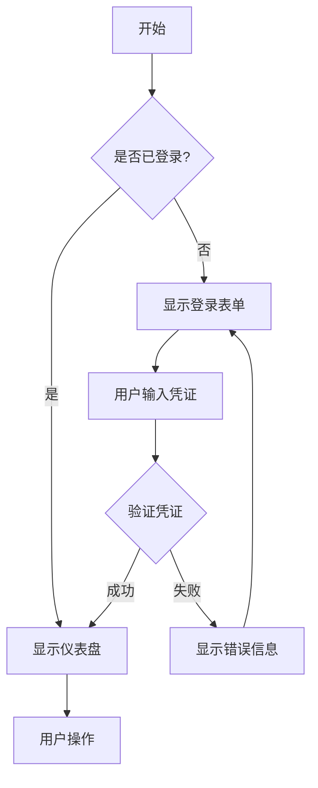
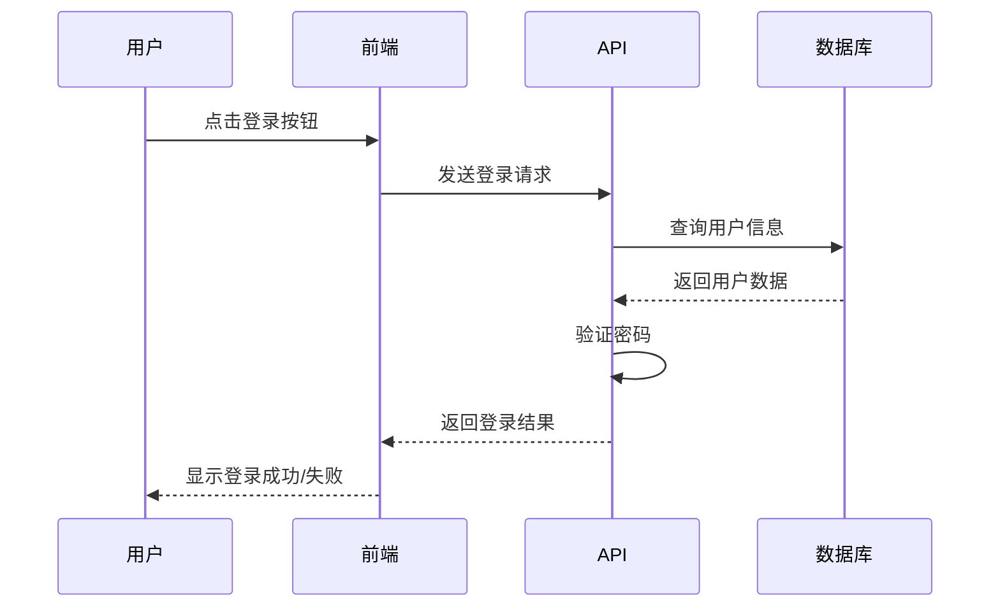
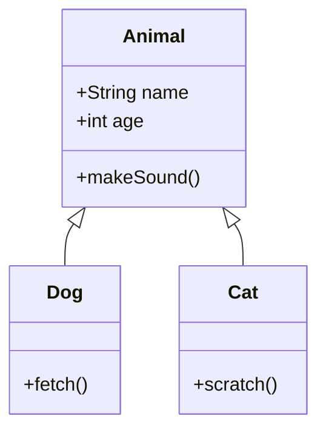
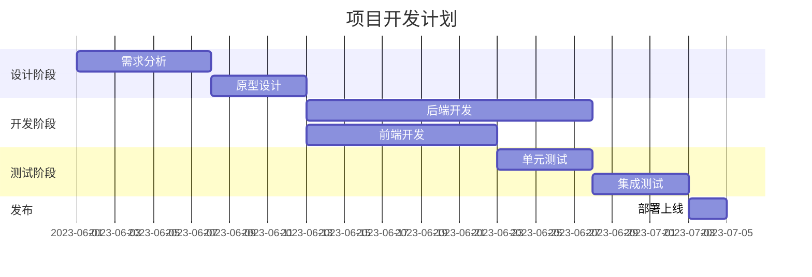

## 数学公式示例

### 行内公式

爱因斯坦的质能方程 $E=mc^2$ 是物理学中最著名的公式之一。

当我们讨论二次方程 $ax^2 + bx + c = 0$ 的解时，可以使用公式 $x = \frac{-b \pm \sqrt{b^2-4ac}}{2a}$ 来求解。

### 独立公式

贝叶斯定理表述为：

$$P(A|B) = \frac{P(B|A) \cdot P(A)}{P(B)}$$

矩阵乘法可以表示为：

$$
\begin{pmatrix} 
a & b \\
c & d 
\end{pmatrix} \cdot
\begin{pmatrix} 
e & f \\
g & h 
\end{pmatrix} =
\begin{pmatrix} 
ae + bg & af + bh \\
ce + dg & cf + dh 
\end{pmatrix}
$$

积分公式示例：

$$\int_{a}^{b} f(x) \, dx = F(b) - F(a)$$

## Mermaid 图表示例

### 流程图



### 时序图



### 类图



### 甘特图



## 如何在文章中启用这些功能

要在文章中启用数学公式或图表功能，只需在文章的前置参数中添加以下配置：

```yaml
---
title: "文章标题"
math: true    # 启用数学公式
diagram: true # 启用图表
---
```

也可以在网站配置中全局启用这些功能：

```toml
[params.math]
  enable = true  # 全局启用数学公式

[params.diagram]
  enable = true  # 全局启用图表
```

这样配置后，只有在需要这些功能的页面才会加载相关资源，提高网站整体性能。 