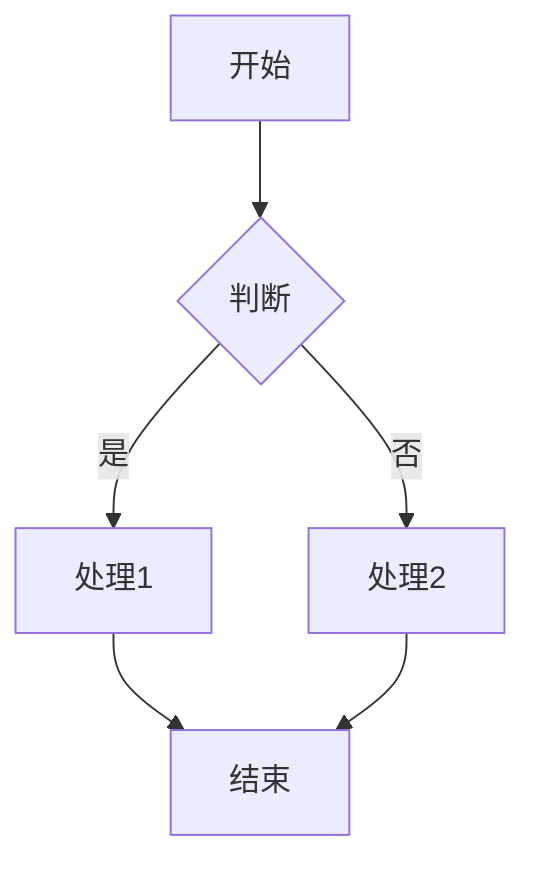

## 1. 标题展示

# h1 标题
## h2 标题
### h3 标题
#### h4 标题
##### h5 标题
###### h6 标题

## 2. 文本格式

这是一段普通文本。

**这是加粗文本**

*这是斜体文本*

***这是加粗斜体文本***

~~这是删除线文本~~

`这是行内代码`

这是一个[链接](https://gohugo.io)

这是一个脚注[^1]

[^1]: 这是脚注的内容

## 3. 引用

> 这是一个引用
>> 这是嵌套引用
>>> 这是三层嵌套引用

## 4. 列表

### 无序列表
- 项目 1
  - 子项目 1.1
  - 子项目 1.2
- 项目 2
  - 子项目 2.1
  - 子项目 2.2

### 有序列表
1. 第一项
   1. 子项目 1
   2. 子项目 2
2. 第二项
   1. 子项目 1
   2. 子项目 2

### 任务列表
- [x] 已完成任务
- [ ] 未完成任务
- [x] 另一个已完成任务

## 5. 代码块

```python
def hello_world():
    print("Hello, Hugo!")
    return True
```

```javascript
function sayHello() {
    console.log("Hello from JavaScript!");
    return true;
}
```

```go
func main() {
    fmt.Println("Hello from Go!")
}
```

```java
public class PatternApplication extends SpringApplication {
    public static void main() {
    }
}
```

## 6. 表格

| 表头 1 | 表头 2 | 表头 3 |
|:-------|:------:|-------:|
| 左对齐 | 居中 | 右对齐 |
| 内容 1 | 内容 2 | 内容 3 |
| 内容 4 | 内容 5 | 内容 6 |

## 7. 图片展示

### 普通图片


### 带有链接的图片
[](https://gohugo.io)

## 8. 水平线

---

## 9. Emoji 表情

这里展示一些常用的 Emoji：

😄 ❤️ 🚀 📚 ☕️ 

更多示例：
🎉 庆祝
🌟 闪耀
🔥 热门
✨ 特效
👍 点赞
🎨 艺术
💡 想法
🎯 目标
📝 笔记
🚀 发布

## 10. 数学公式

行内公式示例：$x = {-b \pm \sqrt{b^2-4ac} \over 2a}$

独立公式示例：

$$
\sum_{n=1}^\infty \frac{1}{n^2} = \frac{\pi^2}{6}
$$

矩阵示例：

$$
\begin{bmatrix}
1 & 2 & 3 \\
4 & 5 & 6 \\
7 & 8 & 9
\end{bmatrix}
$$

多行公式：

$$
\begin{aligned}
f(x) &= (x+a)(x+b) \\
&= x^2 + (a+b)x + ab
\end{aligned}
$$

## 11. 自定义样式块

> 这是一个普通的引用块，可以用来突出显示重要内容。
> 
> 可以包含多行内容。

> 使用多个引用块来区分不同类型的内容。
> 
> 这样可以保持 Markdown 的简洁性。

## 12. Mermaid 图表



## 13. 键盘按键

使用行内代码表示按键：

按下 `Ctrl` + `C` 复制文本

## 14. 术语定义

| 术语 | 定义 |
|------|------|
| Hugo | 一个快速的静态网站生成器 |
| Markdown | 一种轻量级标记语言 |

## 15. 缩写

常见缩写示例：

- WHO：World Health Organization（世界卫生组织）
- HTML：HyperText Markup Language（超文本标记语言）
- URL：Uniform Resource Locator（统一资源定位符）

The WHO was founded in 1948.

## 16. 上标和下标

化学式示例：
- H₂O（水）
- CO₂（二氧化碳）

数学公式示例：
- E = mc²（质能方程）
- x²（平方）
- x³（立方）

注：如果上标和下标比较复杂，建议使用数学公式语法：

$H_2O$ （使用数学公式表示的水分子）

$E = mc^2$ （使用数学公式表示的质能方程）

## 17. 代码块差异展示

```diff
- 这行会被删除
+ 这行会被添加
  这行保持不变
```

## 20. 特殊链接

[内部链接到其他文章]()

[^2]: 这是第二个脚注
[^3]: 这是第三个脚注，可以包含多行内容
    缩进的行属于这个脚注
