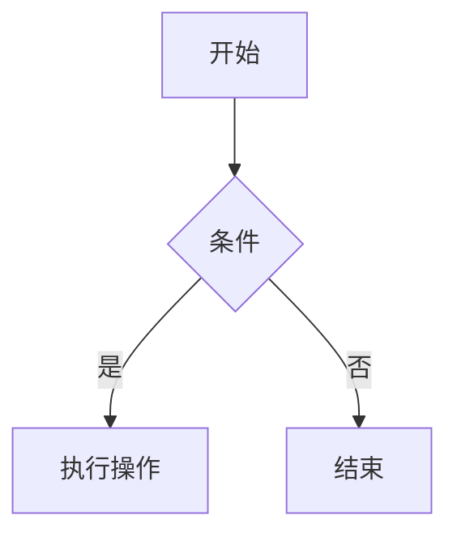

```markdown
# Markdown 示例文档

本文档展示 **Markdown** 的常见语法格式，适用于快速参考。

---

## 目录
1. [标题](#标题)
2. [段落与换行](#段落与换行)
3. [列表](#列表)
4. [文本样式](#文本样式)
5. [代码块](#代码块)
6. [表格](#表格)
7. [链接与图片](#链接与图片)
8. [引用](#引用)
9. [分割线](#分割线)
10. [脚注](#脚注)
11. [任务列表](#任务列表)
12. [Emoji](#emoji)
13. [数学公式](#数学公式)
14. [流程图](#流程图)

---

## 标题
```markdown
# 一级标题
## 二级标题
### 三级标题
#### 四级标题
##### 五级标题
###### 六级标题
```

---

## 段落与换行
段落间用空行分隔。  
行尾添加两个空格表示换行。

---

## 列表

### 无序列表
```markdown
- 项目1
  - 子项目1
  - 子项目2
* 项目2
+ 项目3
```

### 有序列表
```markdown
1. 第一项
2. 第二项
3. 第三项
```

---

## 文本样式
| 样式          | 语法                | 示例           |
|---------------|---------------------|----------------|
| **粗体**      | `**粗体**`          | **粗体文本**   |
| *斜体*        | `*斜体*`            | *斜体文本*     |
| ~~删除线~~    | `~~删除线~~`        | ~~删除线~~     |
| `行内代码`    | `` `代码` ``        | `print("Hi")` |
| 高亮          | `==高亮==`          | ==高亮文本==   |

---

## 代码块
\```python
def hello():
    print("Hello, Markdown!")
\```

渲染效果：
```python
def hello():
    print("Hello, Markdown!")
```

---

## 表格
```markdown
| 左对齐 | 居中对齐 | 右对齐 |
|:-------|:--------:|-------:|
| 单元格 | 单元格   | 单元格 |
| 合并列 || **右对齐** |
```

渲染效果：
| 左对齐      | 居中对齐     | 右对齐      |
|:-----------|:-----------:|-----------:|
| 单元格      | 单元格      | 单元格     |
| 合并列      || **100元**  |

---

## 链接与图片
```markdown
[行内链接](https://example.com)
[参考式链接][1]


[1]: https://example.com
```

---

## 引用
```markdown
> 这是一个引用块  
> 多行引用
> > 嵌套引用
```

---

## 分割线
```markdown
---
***
___
```

---

## 脚注
```markdown
这是一个脚注示例。

: 脚注的详细说明。
```

---

## 任务列表
```markdown
- [x] 已完成任务
- [ ] 未完成任务
```

---

## Emoji
`:joy:` :joy:  
`:rocket:` :rocket:  
（需平台支持）

---

## 数学公式
```latex
$$
f(x) = \int_{-\infty}^\infty \hat f(\xi) e^{2 \pi i \xi x} d\xi
$$
```

渲染效果（需支持 LaTeX）：  
$$ f(x) = \int_{-\infty}^\infty \hat f(\xi) e^{2 \pi i \xi x} d\xi $$

---

## 流程图
\```mermaid
graph TD
    A[开始] --> B{条件}
    B -->|是| C[执行操作]
    B -->|否| D[结束]
\```

渲染效果（需支持 Mermaid）：


---

✅ 本文档覆盖了 Markdown 的常用语法及扩展功能。  
⚠️ 部分功能需编辑器或平台支持（如 Mermaid/LaTeX）。
```